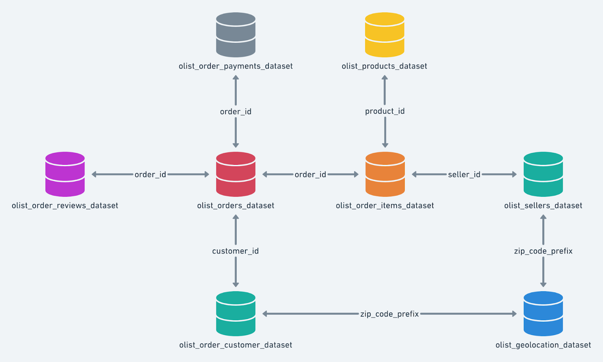

# 📊 Strategic Retail Analysis of Target in South America Using SQL

  

---

Target is a globally renowned brand and a prominent retailer in the United States. Target makes itself a preferred shopping destination by offering outstanding value, inspiration, innovation and an exceptional guest experience that no other retailer can deliver.  
This particular business case focuses on the operations of Target in Brazil and provides insightful information about 100,000 orders placed between 2016 and 2018. The dataset offers a comprehensive view of various dimensions including the order status, price, payment and freight performance, customer location, product attributes, and customer reviews.

🔎 Analyze the dataset in Google BigQuery

📚 The dataset is available in 8 CSV files:

- customers.csv  
- geolocation.csv  
- order_items.csv  
- payments.csv  
- reviews.csv  
- orders.csv  
- products.csv  
- sellers.csv  

---

### Dataset Columns Description:

#### customers.csv

| Features                 | Description                              |
|--------------------------|------------------------------------------|
| customer_id              | ID of the consumer who made the purchase |
| customer_unique_id       | Unique ID of the consumer                 |
| customer_zip_code_prefix | Zip Code of consumer’s location           |
| customer_city           | Name of the City from where order is made |
| customer_state          | State Code from where order is made (Eg. São Paulo - SP) |

#### sellers.csv

| Features               | Description                              |
|------------------------|------------------------------------------|
| seller_id              | Unique ID of the seller registered        |
| seller_zip_code_prefix | Zip Code of the seller’s location         |
| seller_city            | Name of the City of the seller             |
| seller_state           | State Code (Eg. São Paulo - SP)            |

#### order_items.csv

| Features          | Description                                     |
|-------------------|-------------------------------------------------|
| order_id          | A Unique ID of order made by the consumers        |
| order_item_id     | A Unique ID given to each item ordered in the order|
| product_id        | A Unique ID given to each product available on the site |
| seller_id         | Unique ID of the seller registered in Target       |
| shipping_limit_date| The date before which the ordered product must be shipped |
| price             | Actual price of the products ordered               |
| freight_value     | Price rate at which a product is delivered         |

#### geolocations.csv

| Features                 | Description                          |
|--------------------------|--------------------------------------|
| geolocation_zip_code_prefix| First 5 digits of Zip Code           |
| geolocation_lat          | Latitude                              |
| geolocation_lng          | Longitude                             |
| geolocation_city         | City                                  |
| geolocation_state        | State                                 |

#### payments.csv

| Features              | Description                               |
|-----------------------|-------------------------------------------|
| order_id              | A Unique ID of order made by the consumers  |
| payment_sequential    | Sequence of payments made in case of EMI    |
| payment_type          | Mode of payment used (Eg. Credit Card)      |
| payment_installments  | Number of installments in case of EMI purchase |
| payment_value         | Total amount paid for the purchase order     |

#### orders.csv

| Features                   | Description                               |
|----------------------------|-------------------------------------------|
| order_id                   | A Unique ID of order made by the consumers  |
| customer_id                | ID of the consumer who made the purchase    |
| order_purchase_timestamp   | Timestamp when the order was placed          |
| order_delivered_carrier_date | Delivery date at which carrier made delivery |
| order_delivered_customer_date | Date at which customer received the product  |
| order_estimated_delivery_date | Estimated delivery date of the products       |

#### reviews.csv

| Features                 | Description                                   |
|--------------------------|-----------------------------------------------|
| review_id                | ID of the review given on the product ordered by the order id |
| order_id                 | A Unique ID of order made by the consumers      |
| review_score             | Review score given by the customer (1-5 scale)  |
| review_comment_title     | Title of the review                              |
| review_comment_message   | Review comments posted by the consumer           |
| review_creation_date     | Timestamp when the review was created             |
| review_answer_timestamp  | Timestamp when the review was answered            |

#### products.csv

| Features                   | Description                                         |
|----------------------------|-----------------------------------------------------|
| product_id                 | A Unique identifier for the product                  |
| product_category_name      | Name of the product category                          |
| product_name_lenght        | Length of the product name string                     |
| product_description_lenght | Length of the description written for the product    |
| product_photos_qty         | Number of photos available for the product            |
| product_weight_g           | Weight of the product in grams                          |
| product_length_cm          | Length of the product in centimeters                    |
| product_height_cm          | Height of the product in centimeters                     |
| product_width_cm           | Width of the product in centimeters                      |

---

### Dataset Schema

  

---

## Performed Tasks

🔍 Imported the dataset and performed exploratory analysis including:

- Checking the structure & characteristics of the dataset  
- Data types of all columns in the "customers" table  
- Time range in which orders were placed  
- Counting Cities & States of customers who ordered during the period  

🔍 In-depth Exploration:

- Growth trend in number of orders placed over the years  
- Monthly seasonality of orders placed  
- Peak time of day for Brazilian customers placing orders:  
  - Dawn (0-6 hrs)  
  - Morning (7-12 hrs)  
  - Afternoon (13-18 hrs)  
  - Night (19-23 hrs)  

🔍 Evolution of E-commerce orders in Brazil:

- Monthly orders placed in each state  
- Customer distribution across states  

🔍 Economic Impact Analysis:

- Money movement by e-commerce: order prices, freight, etc.  
- Percentage increase in order costs from 2017 to 2018 (Jan-Aug only) based on "payment_value"  
- Total & average order price by state  
- Total & average freight value by state  

🔍 Sales, Freight, and Delivery Time Analysis:

- Number of days taken to deliver each order (delivery time)  
- Difference between estimated & actual delivery dates (delivery accuracy)  

  Formulas used:  
- time_to_deliver = order_delivered_customer_date - order_purchase_timestamp
  diff_estimated_delivery = order_delivered_customer_date - order_estimated_delivery_date

- Top 5 states with highest & lowest average freight values  
- Top 5 states with highest & lowest average delivery times  
- Top 5 states with fastest delivery compared to estimated dates  

🔍 Payment Analysis:

- Monthly orders placed by different payment types  
- Number of orders by payment installments  

---

## 📂 Files in this repository

| File Type               | Description                                |
|-------------------------|--------------------------------------------|
| PDF Report              | [Target_SQL_Case_Study_Analysis.pdf](https://drive.google.com/file/d/1juftKSWKQ7lba4gIXLFxM-fN4307XQUF/view?usp=sharing) |
| Dataset Link            | [Target Brazil Dataset](https://drive.google.com/drive/folders/1cKtUeD_ClK_cuwd2DpRdunONYZNHbwVA?usp=sharing) |

